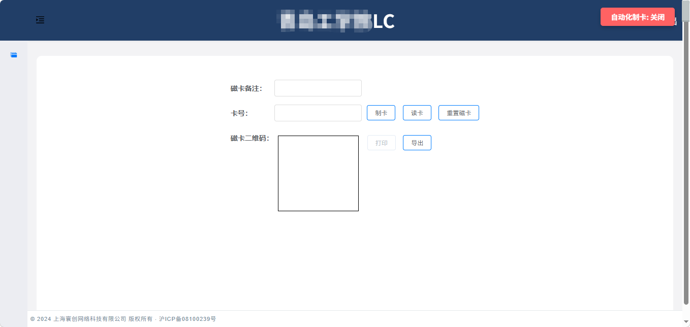

# GiLock自动化制卡脚本

用于寰创GiLock平台制卡页面自动点击制卡并触发打印。

## 功能介绍

- **自动制卡打印**：用于寰创GiLock平台制卡页面自动点击制卡并触发打印，可自由配置循环等待时长，脚本运行时可自动判断制卡编号变化，当制卡编号完全一致时不会自动触发打印，只有当编号更新变化时才会触发打印操作。

## 运行环境

- 浏览器：Chrome 111+
- 或已安装篡改猴

## 使用方法

在篡改猴安装本插件后先进入编辑页面修改脚本内顶部match区域信息（默认为http://192.168.1.1:9300）为项目实际使用的平台内网IP和端口号并保存
打开并刷新项目GiLock制卡页面即可在浏览器右上角点击本插件提供的额外按钮功能

## 注意事项

- 本插件提供油猴插件版本(.js)文件，直接拖入篡改后安装即可
- 安装后务必先修改match配置（默认为http://192.168.1.1:9300）为项目实际使用的平台内网IP和端口号并保存，否则无法正确让脚本匹配并加载自动化开关
- 运行脚本前务必确认好打印机、制卡器已经正确连接到电脑并安装服务且自行手动测试可以正常连续制卡打印
- 工作任务结束后请关闭此脚本开关后再关闭篡改猴本脚本插件即可

## 运行截图

